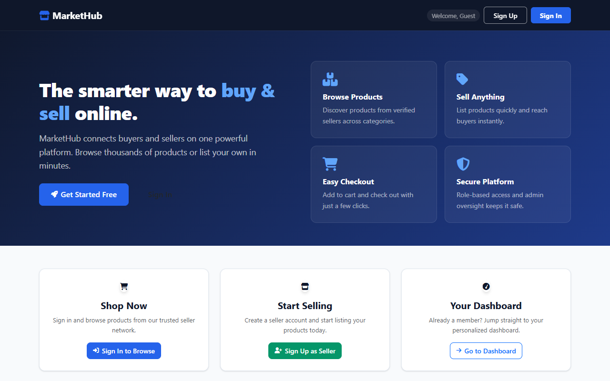
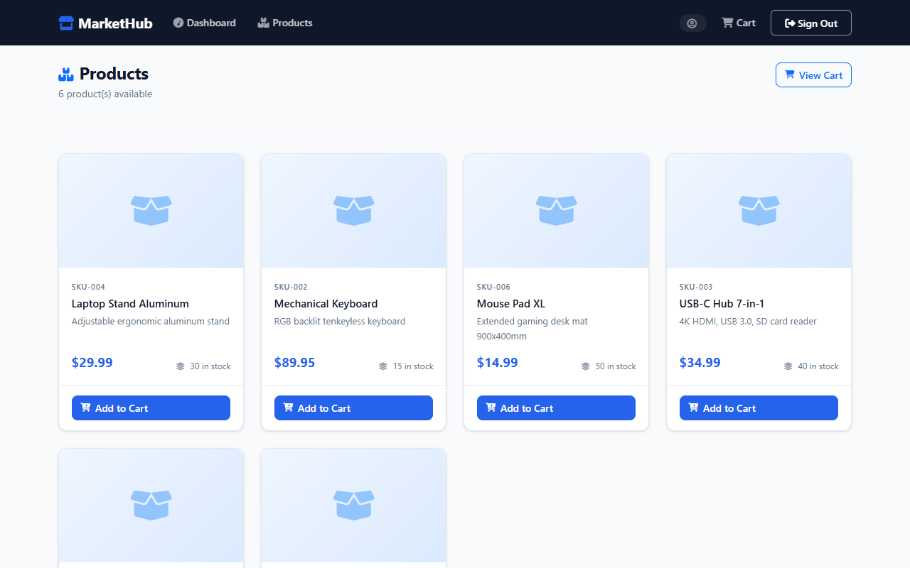
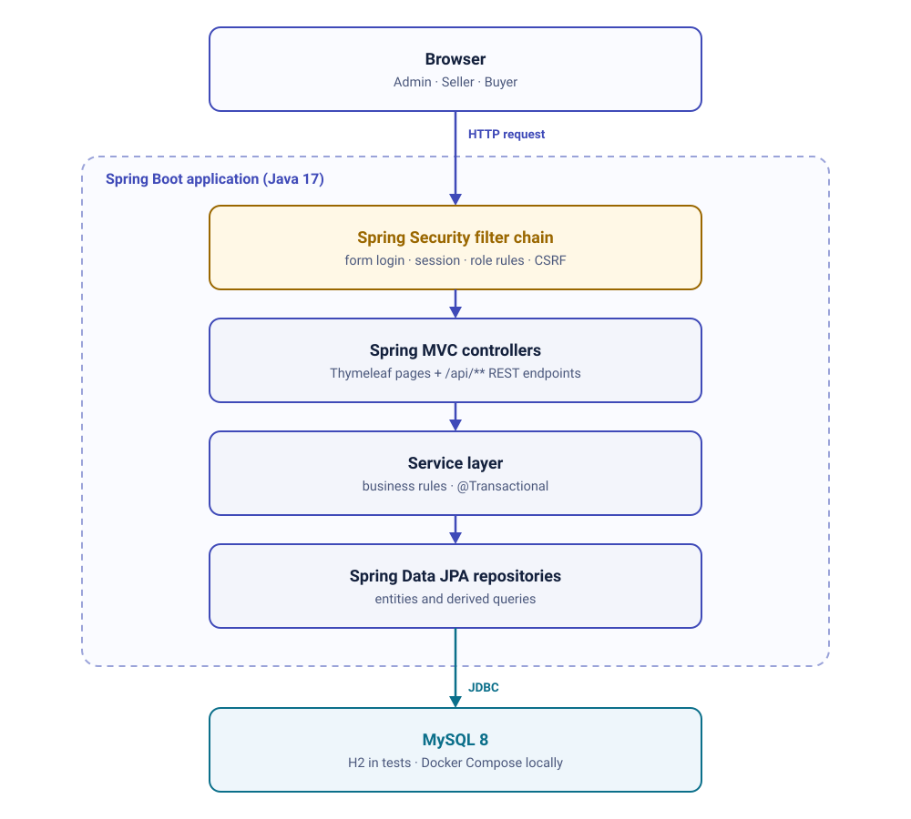
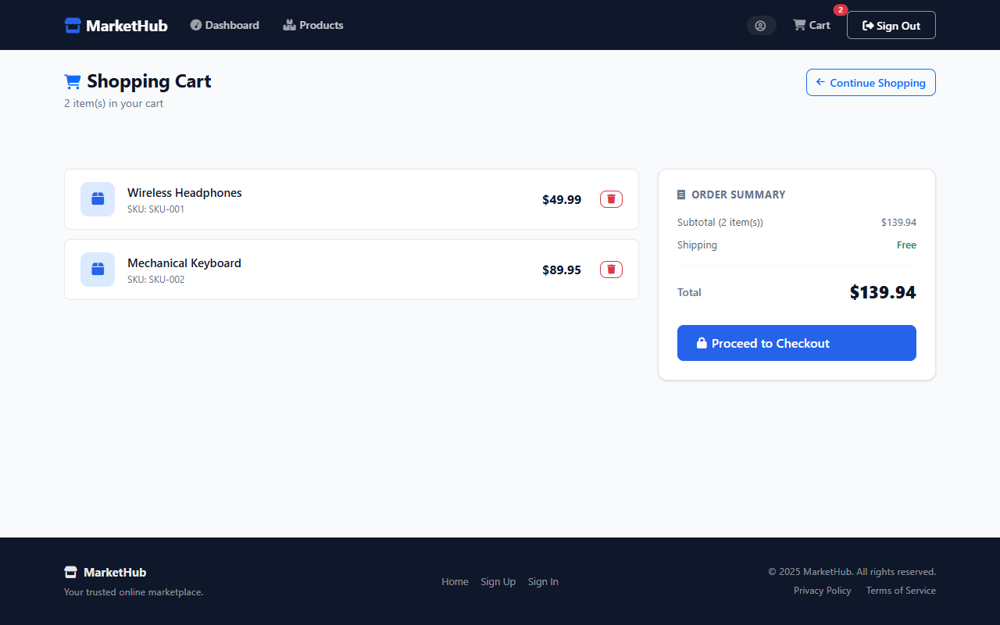
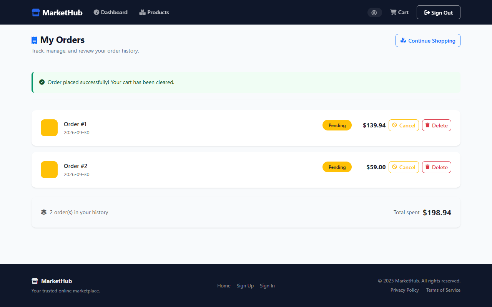
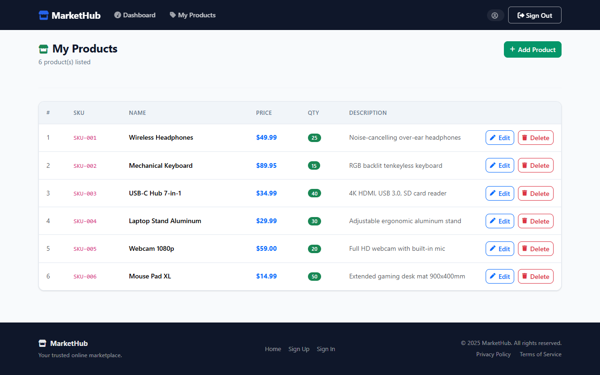
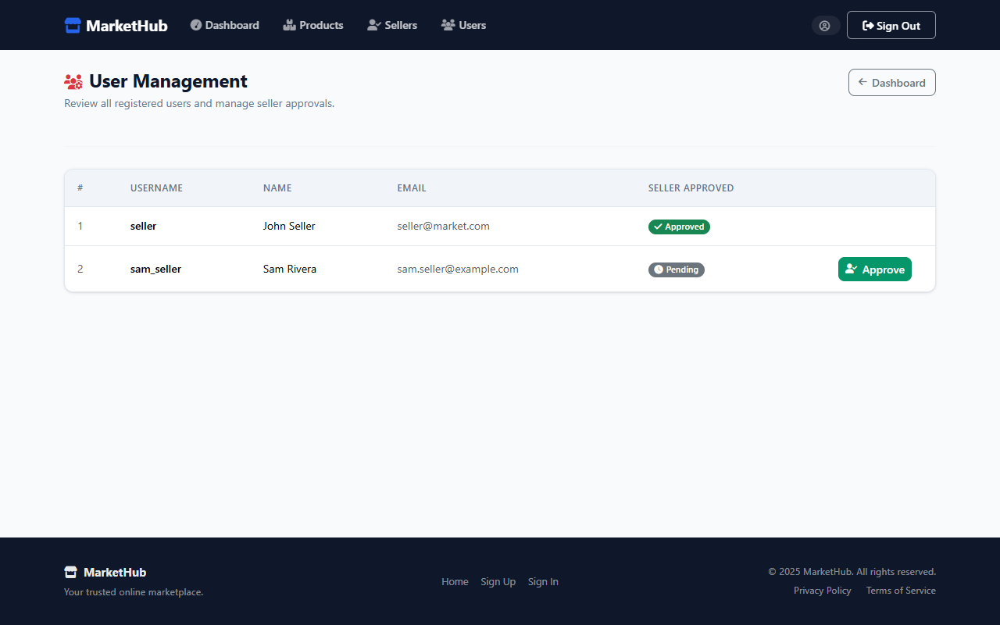

# MarketHub

[](https://github.com/Kalab21/markethub/actions/workflows/ci.yml)

**Full-Stack Java Marketplace** — a Spring Boot monolith with separate Admin, Seller and Buyer workflows,
server-rendered with Thymeleaf, secured with Spring Security and backed by MySQL.

Admins review and approve sellers, approved sellers manage their product listings, and buyers browse the
catalogue, fill a cart and place orders.

| Storefront | Product catalogue |
|------------|-------------------|
|  |  |

## What it demonstrates

- **Layered Spring Boot application** — Spring MVC controllers → `@Transactional` services → Spring Data JPA repositories → MySQL 8
- **Role-based access with Spring Security** — form login, server-side session, BCrypt, URL rules and `@PreAuthorize`
- **Record-level authorization** — enforced seller approval and per-record ownership checks, not only role checks
- **Three role workflows** — Admin, Seller and Buyer each get their own dashboard and navigation
- **Cart-to-order flow** — cart totals, checkout into a `Pending` order, cancel and order history
- **Server-rendered UI** — Thymeleaf master layout with self-hosted Bootstrap 5.3 and Font Awesome 6
- **Tested and built in CI** — 77 tests (38 authorization tests through the real security filter chain), Maven build and Docker image build on every push and pull request

## Architecture

<p align="center">
  <picture>
    <source media="(prefers-color-scheme: dark)" srcset="docs/markethub-architecture-dark.svg">
    
  </picture>
</p>

<details>
<summary>Text version</summary>

```
Browser  (Admin | Seller | Buyer)
   ↓  web request
Spring Boot application
   Spring Security filter chain   form login, session, roles, CSRF
      ↓
   Spring MVC controllers         Thymeleaf + Bootstrap pages, /api/** REST
      ↓
   Service layer                  business rules, @Transactional
      ↓
   Spring Data JPA repositories
   ↓  JDBC
MySQL 8  (H2 in tests)
```

</details>

Every request passes the Spring Security filter chain before reaching a controller. Controllers render
Thymeleaf pages for the browser UI and expose `/api/**` REST endpoints over the same services; services
own business rules and transactions; repositories are the only layer that talks to the database.

**Design trade-off:** MarketHub is a single deployable chosen for the application's scope — one codebase,
one process and one database, with layering rather than service boundaries keeping the concerns apart.

The diagram is generated by [`docs/diagrams/generate_diagrams.py`](docs/diagrams/generate_diagrams.py).
Domain model, security rules and design decisions are described in [PROJECT.md](PROJECT.md).

## Role-based workflows

| Role | What they can do |
|------|------------------|
| **Admin** | View sellers and approve pending seller accounts; admin-only user API and order listing/deletion API |
| **Seller** | Once approved, create, edit and delete their own product listings (name, SKU, price, stock) |
| **Buyer** | Browse the catalogue, manage a cart, check out, cancel pending orders, view order history |

New accounts can self-register as Buyer or Seller only; Admin accounts cannot be self-registered.

| Shopping cart | Order history |
|---------------|---------------|
|  |  |

| Seller: my products | Admin: seller approval |
|---------------------|------------------------|
|  |  |

## Security & Trust Boundaries

The browser is outside the trust boundary; the Spring Boot application enforces every access decision;
MySQL is reached only through the repository layer.

- **Authentication** — Spring Security form login with a server-side HTTP session; passwords hashed with `BCryptPasswordEncoder` (strength 12).
- **CSRF** — every state-changing web action (cart, checkout, order cancel/delete, product delete, seller approval, sign out) is a CSRF-protected `POST`; `GET` requests only read.
- **Role-based authorization** — URL rules per role (admin pages → `ADMIN`, seller product pages → `SELLER`, cart and orders → `BUYER`) plus `@PreAuthorize("hasRole('ADMIN')")` on seller approval and the admin API.
- **Enforced seller approval** — creating, editing or deleting a product (web and API) requires an approved seller; admins are exempt.
- **Record-level ownership** — [`AccessGuard`](src/main/java/com/markethub/app/security/AccessGuard.java) ensures sellers change only their own products and buyers use only their own cart and orders; the owner of a new record is always the signed-in user, never a request value. Refusals return `403`.
- **Tested through the real filter chain** — 38 `@SpringBootTest` authorization tests assert `403` for cross-role, cross-owner, unapproved-seller and missing-CSRF requests, and assert the data is unchanged afterwards.

Full URL and ownership rules are in [PROJECT.md](PROJECT.md#security-architecture).

## Testing

77 tests across 8 test classes, run with `mvn clean verify` against an in-memory H2 database:

| Type | Classes | Tests |
|------|---------|-------|
| Service unit tests (Mockito) | `UserServiceImplTest`, `ProductServiceImplTest`, `ShoppingCartServiceImplTest` | 19 |
| Repository tests (`@DataJpaTest`, H2) | `UserRepositoryIntegrationTest`, `ProductRepositoryIntegrationTest` | 14 |
| Controller tests (`@WebMvcTest`, MockMvc) | `ProductApiControllerTest` | 5 |
| Authorization, ownership and CSRF tests (`@SpringBootTest`, MockMvc, real security filter chain) | `AuthorizationIntegrationTest` | 38 |
| Application context | `MarketHubApplicationTests` | 1 |

GitHub Actions runs the full Maven build and tests, then builds the Docker image. JaCoCo coverage is uploaded as a build artifact.

## Technology

| Layer | Technology |
|-------|------------|
| Language / framework | Java 17, Spring Boot 3.3.6 |
| Web | Spring MVC, Thymeleaf, Bootstrap 5.3, Font Awesome 6 |
| Security | Spring Security 6 |
| Persistence | Spring Data JPA (Hibernate), MySQL 8, MySQL Connector/J 9.1.0 |
| API docs / ops | SpringDoc OpenAPI 2.6.0, Spring Boot Actuator |
| Testing | JUnit 5, Mockito, MockMvc, H2, JaCoCo |
| Build / CI | Maven wrapper, Docker (multi-stage build), Docker Compose, GitHub Actions |

## Project scope

Runs locally for demonstration; deployment infrastructure is outside this repository.

## Run locally

### Option 1 — Docker Compose

```bash
docker compose up --build
```

This builds the app from source and starts MySQL. Open `http://localhost:8081`.
Compose uses the local demo values in [`.env.example`](.env.example) by default (demo defaults, not secrets);
copy it to `.env` only if you want different values.

### Option 2 — IDE / Maven wrapper (Java 17)

Start only the database, then run the app. The default datasource settings already
point at the Compose database (`localhost:3307`), so no files need editing:

```bash
docker compose up -d db

./mvnw spring-boot:run       # macOS / Linux
mvnw.cmd spring-boot:run     # Windows
```

To use your own MySQL instead, set `MYSQLHOST`, `MYSQLPORT`, `MYSQLDATABASE`,
`MYSQLUSER` and `MYSQLPASSWORD` before starting the app.

### Demo accounts

Synthetic Admin, Seller and Buyer accounts are seeded automatically on first start, together with six sample
products. Demo access details are in [PROJECT.md](PROJECT.md#demo-accounts).

### Useful URLs

- App: `http://localhost:8081`
- Swagger UI: `http://localhost:8081/swagger-ui.html`
- Health: `http://localhost:8081/actuator/health`

## Documentation

[PROJECT.md](PROJECT.md) — architecture, security rules, domain model, design decisions (including checkout,
which creates a `Pending` order with no payment provider), database and test suite in more depth.
